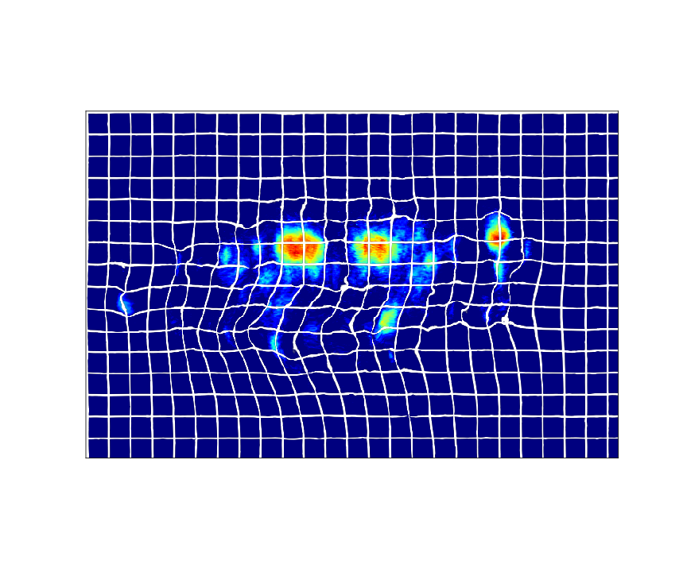

stabilize2p
==========

.. image:: https://img.shields.io/badge/license-GNU%20GPL%20v2.0-yellow
    :target: https://opensource.org/licenses/GPL-2.0
    :alt: License: GNU GPL v2.0

\
    

    
    
Different approaches to stabilize 2-photon imaging video.

You can find a report on the methodologies implemented in this package in `assets/report.pdf <assets/report.pdf>`_.

Documentation
-------------

You can find documentation for stabilize2p in `GitHub pages <https://sager611.github.io/stabilize2p>`_.

Requirements
------------

`make <https://www.gnu.org/software/make/>`_ should be installed.

If you want to install tensorflow with Nvidia GPU support you have to install the `CUDA Toolkit <https://developer.nvidia.com/cuda-toolkit>`_ and `cuDNN <https://developer.nvidia.com/cudnn>`_.
Instructions are system-dependent. Otherwise, if you have `Anaconda <https://www.anaconda.com/>`_ installed, you can install them through:

.. code:: shell

    conda install -c conda-forge cudatoolkit cudnn

Installation
------------

Run:

.. code:: shell

    make install
    pip install -e .

Image registration
------------------

The following methods are included for image registration:

- `PyStackReg <https://github.com/glichtner/pystackreg>`_: is an affine transformation algorithm.
- `OFCO <https://github.com/NeLy-EPFL/ofco/tree/master/ofco>`_: is a variational approach that learns a complex deformable transformation.
- `VoxelMorph <https://github.com/voxelmorph/voxelmorph>`_: is a learning-based deep neural network (DNN) based on an UNet.
- `HyperMorph <https://github.com/voxelmorph/voxelmorph>`_: is a hypernetwork that learns optimal VoxelMorph models according to some hyper-parameter.
- `ECC maximization <https://ieeexplore.ieee.org/abstract/document/4515873/>`_: Enhanced Correlation Coefficient (ECC) maximization is an affine algorithm for image registration implemented in `OpenCV <https://opencv.org/>`_.

To register an image or set of images you can easily use the script provided under ``bin/register.py``. For example:

.. code:: shell

    python bin/register.py --method ofco -i path/to/file.tif -o path/to/output.tif

Registers ``path/to/file.tif`` using OFCO and saves the results in ``path/to/output.tif``.

**Warning: All input and output images are assumed to be in TIFF format! You can use** ``bin/raw2tiff`` **to convert raw 2-photon images to TIFF files**

VoxelMorph and HyperMorph needs you to specify where the trained network is saved:

.. code:: shell

    python bin/register.py --method voxelmorph --net models/vxm_drosophila_2d_1000.h5 -i path/to/file.tif -o path/to/output.tif

If you want to use the same predicted deformation field to transform other images, simply add more files to the ``-i`` and ``-o`` arguments. For example:

.. code:: shell

    python bin/register.py --method pystackreg -i reference.tif file1.tif file2.tif  -o reference-out.tif out1.tif out2.tif

You can find more information with ``python bin/register.py --help``. For other scripts, check the `additional scripts section <#additional-scripts>`_.

Notebooks
---------

You can find a set of JupyterLab notebooks in `notebooks/ </notebooks>`_.
They require the 2-photon imaging dataset to be saved in a ``data/`` directory.

Please create in the project root folder a ``data/`` link pointing to the directory
with the dataset. For example:

.. code:: shell

    $ ln -s /path/to/data "${PWD}/data"
    $ vdir -ph data/
    total 2.5M
    drwxrwxrwx 1 admin admin 256K Sep  4 11:23 200901_G23xU1/
    drwxrwxrwx 1 admin admin 256K Sep  5 20:52 200908_G23xU1/
    drwxrwxrwx 1 admin admin 256K Sep  6 05:04 200909_G23xU1/
    drwxrwxrwx 1 admin admin 256K Sep  6 14:11 200910_G23xU1/
    drwxrwxrwx 1 admin admin 256K Sep  7 17:37 200929_G23xU1/
    drwxrwxrwx 1 admin admin 256K Sep  7 22:52 200930_G23xU1/
    drwxrwxrwx 1 admin admin 256K Sep  8 02:19 201002_G23xU1/

Additional scripts
------------------

The ``bin/`` folder contains scripts you may find useful to deal with
the dataset.

To run these scripts you need to `install stabilize2p first <#installation>`_.

Scripts:

-  raw2tiff: shell script to transform raw 2-photon video to a TIFF file.
-  register.py: general registration script.
-  train-voxelmorph.py: train a Voxelmorph model using a pool of files. Check ``train-voxelmorph.py --help`` for more information.
-  train-hypermorph.py: train a Hypermorph model using a pool of files. Check ``train-hypermorph.py --help`` for more information.

About
-----

This project, done in Fall 2021, is in the context of the work being done in `Pavan Ramdya's Lab at EPFL <https://www.epfl.ch/labs/ramdya-lab/>`_.
